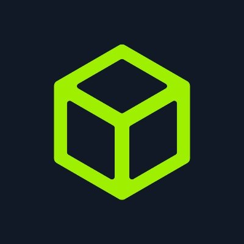

## Whoami

```plain
Aspire, be curious, learn, help, teach, improve, innovate.
```

<br>

## GitHub stats
<a href="https://github.com/anuraghazra/github-readme-stats">
  
</a>
<a href="https://github.com/anuraghazra/convoychat">
  
</a>

<br><br>

## CTFs created

<p align="center">
  <a href="https://mirachron.com" target="_blank"></a>
  &nbsp;&nbsp;&nbsp;&nbsp;&nbsp;&nbsp;&nbsp;
  <a href="https://mirachron.com" target="_blank"></a>
  &nbsp;&nbsp;&nbsp;&nbsp;&nbsp;&nbsp;&nbsp;
</p>

<br>

## Cybersecurity Profiles

<p align="center">
  <a href="https://tryhackme.com/p/s.marin.ionut" target="_blank"></a>
  &nbsp;&nbsp;&nbsp;&nbsp;&nbsp;&nbsp;&nbsp;
  <a href="https://app.hackthebox.com/profile/691012" target="_blank"></a>
  &nbsp;&nbsp;&nbsp;&nbsp;&nbsp;&nbsp;&nbsp;
  <a href="https://www.linkedin.com/in/radumarin001/" target="_blank"></a>
  &nbsp;&nbsp;&nbsp;&nbsp;&nbsp;&nbsp;&nbsp;
  <a href="https://discord.com/users/602129324136464394" target="_blank"></a>
  &nbsp;&nbsp;&nbsp;&nbsp;&nbsp;&nbsp;&nbsp;
  <a href="https://app.cyber-edu.co/user/89f41bb0-25ea-11ec-85ba-b5c17388972b" target="_blank"></a>
  &nbsp;&nbsp;&nbsp;&nbsp;&nbsp;&nbsp;&nbsp;
  <a href="https://play.picoctf.org/users/Radupk" target="_blank"></a>
</p>

<br>

## Applications in Development

<p>
  <a href = "https://piece.mirachron.com" align = "center">Mirachron - Pentesting Interactive & Exhaustive Command Explorer</a>
</p>

<br>

## Main Github Projects

<p align="center">
  
  
<br><br>
  
  
</a>
</p>

<br>

## Sponsor Me

<p align="center">
  
  &nbsp;&nbsp;&nbsp;&nbsp;
  
</p>
