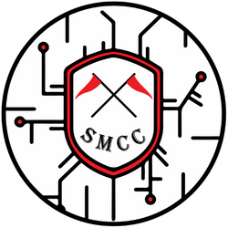

## Whoami

```plain
Student, aspiring ethical hacker, CTF player, inquisitive curious. 
```

<a href="https://chronossec.site/s/whoami/" target="_blank" rel="noopener noreferrer"></a>

<br><br>

## CTFs I created

<p>
  <a href="https://chronossec.site/SMCC_2023_DEV/" target="_blank"></a>
  &nbsp;&nbsp;&nbsp;&nbsp;&nbsp;&nbsp;&nbsp;
  <a href="https://smcc2024.com" target="_blank"></a>
  &nbsp;&nbsp;&nbsp;&nbsp;&nbsp;&nbsp;&nbsp;
</p>

<br><br>

## Cybersecurity Profiles

<p>
  <a href="https://tryhackme.com/p/s.marin.ionut" target="_blank"></a>
  &nbsp;&nbsp;&nbsp;&nbsp;&nbsp;&nbsp;&nbsp;
  <a href="https://app.hackthebox.com/profile/691012" target="_blank"></a>
  &nbsp;&nbsp;&nbsp;&nbsp;&nbsp;&nbsp;&nbsp;
  <a href="https://www.linkedin.com/in/radumarin001/" target="_blank"></a>
  &nbsp;&nbsp;&nbsp;&nbsp;&nbsp;&nbsp;&nbsp;
  <a href="https://discord.com/users/602129324136464394" target="_blank"></a>
  &nbsp;&nbsp;&nbsp;&nbsp;&nbsp;&nbsp;&nbsp;
  <a href="https://chronossec.site/s/" target="_blank"></a>
  &nbsp;&nbsp;&nbsp;&nbsp;&nbsp;&nbsp;&nbsp;
  <a href="https://app.cyber-edu.co/user/89f41bb0-25ea-11ec-85ba-b5c17388972b" target="_blank"></a>
  &nbsp;&nbsp;&nbsp;&nbsp;&nbsp;&nbsp;&nbsp;
  <a href="https://play.picoctf.org/users/Radupk" target="_blank"></a>
</p>

<br><br>


## Sponsor me ♥

<a href="https://www.buymeacoffee.com/chronossec" target="_blank"></a>
&nbsp;&nbsp;&nbsp;&nbsp;
<a href="https://github.com/sponsors/ChronosPK">
  
</a>


<br><br>


## Main Github Projects

<a href = "https://github.com/ChronosPk/pentesting-cheatsheets" target="_blank">

</a>
<a href = "https://github.com/ChronosPk/SMCC-2023" target="_blank">

</a> 
<br><br>
<a href = "https://github.com/ChronosPk/WiFI_locally_extract_passwords" target="_blank">

</a> 
<a href = "https://github.com/ChronosPk/port-grabber" target="_blank">

</a> 
<br><br>
<a href = "https://github.com/ChronosPk/APET" target="_blank">

</a> 

<br><br>

## Main projects on my personal website
<p>
  <a href="https://chronossec.site/s/cheatsheets/pentest-enumertation" target="_blank"></a>
  &nbsp;&nbsp;&nbsp;&nbsp;&nbsp;&nbsp;&nbsp;
  <a href="https://chronossec.site/s/cheatsheets/learning-resources" target="_blank"></a>
  &nbsp;&nbsp;&nbsp;&nbsp;&nbsp;&nbsp;&nbsp;
  <a href="https://chronossec.site/s/writeups/cert-prep/" target="_blank"></a>
  &nbsp;&nbsp;&nbsp;&nbsp;&nbsp;&nbsp;&nbsp;
  <a href="https://chronossec.site/SMCC_2023_development/" target="_blank"></a>
</p>
